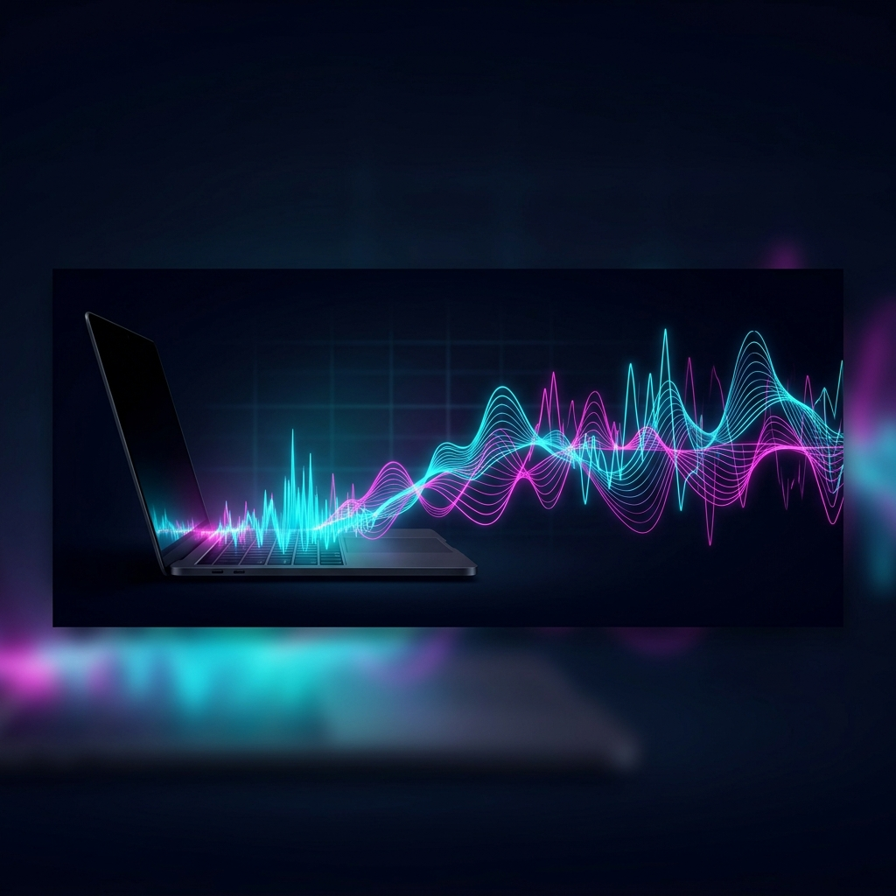
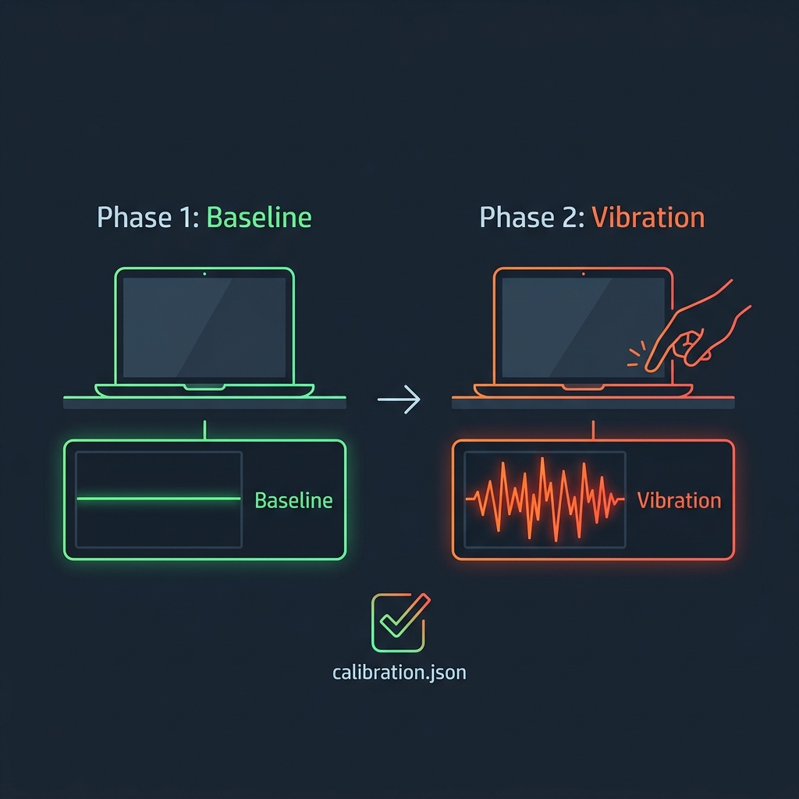
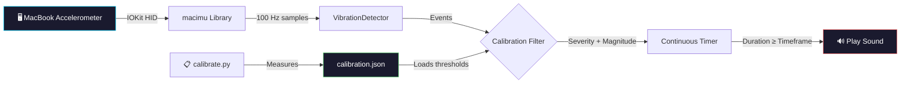

<div align="center">



# 🎵 MacBook Vibration Player

### _Turn your MacBook's hidden accelerometer into a vibration-triggered sound player_

<br/>

[](https://python.org)
[](https://www.apple.com/macbook-pro/)
[](LICENSE)
[](https://github.com/olvvier/apple-silicon-accelerometer)

<br/>

> **Tap it. Knock it. Shake it.** Your MacBook plays a sound when it detects continuous vibration.
> Uses the undocumented MEMS accelerometer in Apple Silicon chips (M2/M3/M4/M5).

---

</div>

<br/>

## ✨ Features

<table>
<tr>
<td width="50%">

### 🔊 Vibration → Sound
Detects continuous vibration on your MacBook and automatically plays your custom MP3 file.

### 🎯 Smart Calibration
Two-phase calibration measures your specific MacBook's noise floor and vibration response for pixel-perfect triggering.

### 📊 Real-time Monitoring
Live accelerometer magnitude display so you can see exactly what your MacBook senses.

</td>
<td width="50%">

### ⚡ Sensitivity Presets
Three presets — **LOW** (strong knocks only), **MEDIUM** (balanced), **HIGH** (light taps) — fine-tuned to your hardware.

### 🛡️ Multi-Layer Detection
STA/LTA ratios, CUSUM, kurtosis, crest factor, and MAD peak detection working together for robust vibration classification.

### 🎛️ Fully Configurable
Custom cooldowns, timeframes, tolerance windows, and severity filters. CLI flags override calibration values.

</td>
</tr>
</table>

<br/>

---

<br/>

## 🚀 Quick Start

```bash
# Clone the repo
git clone https://github.com/E27-25/macbook-vibration-player.git
cd macbook-vibration-player

# Set up virtual environment
python3 -m venv .venv && source .venv/bin/activate
pip install -e .[demo]
pip install python-dotenv

# Create .env with your Mac password (for auto sudo)
echo 'MAC_PASSWORD=your_password_here' > .env

# Run the vibration player!
python3 vibrate_player.py
```

> [!NOTE]
> Requires **sudo** because IOKit HID device access needs elevated privileges. The script auto-elevates using the password in `.env`.

<br/>

---

<br/>

## 🎯 Calibration

<div align="center">



</div>

<br/>

The calibration tool measures your MacBook's unique accelerometer characteristics and generates a `calibration.json` profile.

### How it works

| Phase | What happens | Duration |
|:-----:|:-------------|:--------:|
| **① Baseline** | MacBook sits still — measures noise floor and gravity vector | 3-5 sec |
| **② Vibration** | You tap and shake — measures real vibration response | 5-10 sec |
| **③ Profile** | Computes optimal thresholds based on your measurements | Instant |

### Run calibration

```bash
# Full calibration (recommended for first time)
python3 calibrate.py

# Quick calibration with high sensitivity
python3 calibrate.py --quick --sensitivity high

# Custom output file
python3 calibrate.py --output my_desk_profile.json
```

### Example output

```
╔═══════════════════════════════════════╗
║   VIBRATE PLAYER CALIBRATION TOOL     ║
╚═══════════════════════════════════════╝

  PHASE 1: BASELINE MEASUREMENT
  ██████████████████████████████████████░░  99.8%  mag:1.001463g

  ✓ Baseline captured: 299 samples
  Mean |g|     : 0.999967g
  Noise floor  : 0.004336g (2σ)

  PHASE 2: VIBRATION MEASUREMENT
  █████████████████████████████░  99.8%  ███████████████  evts:162

  ✓ Vibration data captured: 806 samples, 162 events

  CALIBRATION PROFILE SUMMARY
  Sensitivity      : HIGH
  Noise floor      : 0.004781g
  Trigger threshold: 0.011952g
  Timeframe        : 1.0s

  ✓ Calibration saved to: calibration.json
```

<br/>

---

<br/>

## 🎮 Usage

### Basic usage (auto-loads `calibration.json` if present)

```bash
python3 vibrate_player.py
```

### With explicit calibration file

```bash
python3 vibrate_player.py --calibration calibration.json
```

### Custom sound file

```bash
python3 vibrate_player.py my_sound.mp3
```

### Override parameters

```bash
# Very sensitive: trigger after 0.5s of vibration
python3 vibrate_player.py --timeframe 0.5 --tolerance 0.2 --cooldown 1.0

# Conservative: only trigger after 5s of sustained vibration
python3 vibrate_player.py --timeframe 5.0 --tolerance 1.0 --cooldown 5.0
```

<br/>

---

<br/>

## 🏗️ Architecture



<br/>

### Detection Pipeline

The vibration detection uses **5 independent algorithms** running in parallel:

| Algorithm | Window | What it catches |
|:----------|:------:|:----------------|
| **STA/LTA** (3 timescales) | 3-2000 samples | Sudden energy changes vs background |
| **CUSUM** | Cumulative | Gradual drift detection |
| **Kurtosis** | 1 second | Impulsive / spiky signals |
| **Crest Factor** | 2 seconds | Peak-to-RMS ratio |
| **MAD Peak** | 2 seconds | Outliers via median absolute deviation |

Events are classified into severity levels:

```
★ CHOC_MAJEUR  →  Major impact (4+ detectors, amp > 0.05g)
▲ CHOC_MOYEN   →  Medium shock (3+ detectors, amp > 0.02g)
△ MICRO_CHOC   →  Micro impact (peak detection, amp > 0.005g)
● VIBRATION    →  Sustained vibration (STA/LTA or CUSUM, amp > 0.003g)
○ VIB_LEGERE   →  Light vibration (amp > 0.001g)
· MICRO_VIB    →  Micro vibration (below threshold)
```

<br/>

---

<br/>

## 📂 Project Structure

```
macbook-vibration-player/
├── 🎵 vibrate_player.py     # Main player — listens & plays sounds
├── 🎯 calibrate.py          # Calibration tool — measures your MacBook
├── 📊 motion_live.py        # Full dashboard (vibration, heartbeat, orientation)
├── 📦 macimu/               # Core accelerometer library
│   ├── __init__.py           #   High-level IMU class
│   ├── _spu.py               #   Low-level IOKit HID bindings
│   ├── filters.py            #   Butterworth filters, peak detect, etc.
│   └── orientation.py        #   Mahony AHRS quaternion filter
├── 💡 KBPulse/              # Keyboard backlight flash driver
├── 🎵 k.mp3                 # Default notification sound
├── ⚙️ .env                   # Mac password for auto-sudo
├── 📋 calibration.json      # Generated calibration profile
└── 📄 pyproject.toml        # Package metadata
```

<br/>

---

<br/>

## 🧪 Sensitivity Guide

<div align="center">

| Setting | Trigger Threshold | Timeframe | Best For |
|:-------:|:-----------------:|:---------:|:---------|
| 🟢 **LOW** | ~6× noise floor | 3.0s | Strong knocks, drops, bumps |
| 🟡 **MEDIUM** | ~4× noise floor | 2.0s | Table taps, typing, general use |
| 🔴 **HIGH** | ~2.5× noise floor | 1.0s | Light taps, footsteps, music bass |

</div>

<br/>

---

<br/>

## 🔧 Configuration Reference

### CLI Arguments — `vibrate_player.py`

| Argument | Default | Description |
|:---------|:-------:|:------------|
| `mp3_file` | `k.mp3` | Path to the sound file to play |
| `--calibration`, `-c` | auto-detect | Path to `calibration.json` |
| `--timeframe` | `2.0` | Seconds of continuous vibration needed to trigger |
| `--tolerance` | `0.5` | Seconds of quiet before resetting the timer |
| `--cooldown` | `2.0` | Minimum seconds between sound plays |

### CLI Arguments — `calibrate.py`

| Argument | Default | Description |
|:---------|:-------:|:------------|
| `--output`, `-o` | `calibration.json` | Output file path |
| `--sensitivity`, `-s` | `medium` | Preset: `low`, `medium`, `high` |
| `--quick`, `-q` | off | Shorter measurement durations |
| `--baseline-duration` | `5.0` | Baseline phase duration (seconds) |
| `--vibration-duration` | `10.0` | Vibration phase duration (seconds) |

<br/>

---

<br/>

## 🎥 Demo

<div align="center">


<br/>

_The full `motion_live.py` dashboard showing real-time vibration detection, waveforms, spectrogram, orientation, heartbeat BCG, and more._

</div>

<br/>

---

<br/>

## ⚙️ Requirements

- **macOS** with Apple Silicon (M2, M3, M4, M5)
- **Python** 3.9+
- **sudo** access (for IOKit HID)

### Tested On

| Device | macOS | Python | Status |
|:-------|:------|:-------|:------:|
| MacBook Pro M3 Pro | 15.6.1 | 3.14 | ✅ |
| MacBook Air M2 | 15.x | 3.9+ | ✅ |

### Known Incompatible

- ❌ Intel Macs (no SPU)
- ❌ M1 MacBook Pro (2020)
- ❌ Mac Studio M4 Max

<br/>

---

<br/>

## 🤝 Credits

Built on top of the incredible [**macimu**](https://github.com/olvvier/apple-silicon-accelerometer) library by [olvvier](https://github.com/olvvier), which reverse-engineered Apple's undocumented SPU HID interface.

<br/>

## 📜 License

MIT License — see [LICENSE](LICENSE) for details.

<br/>

---

<div align="center">

_Made with ❤️ and a lot of tapping on MacBooks_

<br/>

**⭐ Star this repo if you found it useful!**

</div>
